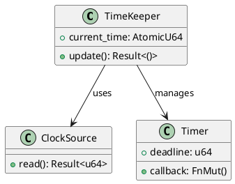
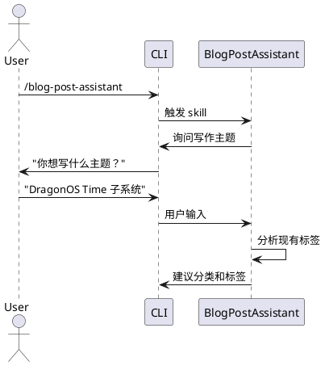

# 技术写作最佳实践

本文档提供技术写作的具体实践指导，包括代码、数学公式、图表、术语、参考资料等方面的最佳实践。

## 代码相关

### 代码示例

**完整性**：
- 代码可以独立运行（如果有必要）
- 包含必要的头文件或导入
- 有清晰的变量命名

**注释**：
- 关键步骤有注释
- 注释解释"为什么"而不只是"做什么"
- 注释不翻译代码，而是提供上下文

**输出**：
- 提供预期的输出结果
- 如果有错误情况，说明错误输出

**示例**：
```cpp
// 不好的代码示例（缺少注释和上下文）
std::vector<int> v = {1, 2, 3};
std::sort(v.begin(), v.end());

// 好的代码示例（有注释和完整上下文）
#include <algorithm>
#include <vector>
#include <iostream>

int main() {
    // 创建一个未排序的 vector
    std::vector<int> v = {3, 1, 4, 1, 5, 9};

    // std::sort 默认按升序排序，时间复杂度 O(n log n)
    std::sort(v.begin(), v.end());

    // 输出：1 1 3 4 5 9
    for (int x : v) {
        std::cout << x << " ";
    }
    std::cout << std::endl;

    return 0;
}
```

---

### 代码解释

**不说废话**：
- 不要逐行翻译代码
- 不要解释显而易见的语法

**解释为什么**：
- 为什么要用这个方法？
- 为什么这样设计？
- 有什么权衡和考量？

**指出关键点**：
- 用注释或加粗标出关键行
- 解释容易出错的地方
- 说明设计决策

**示例**：
```markdown
❌ 不好的代码解释（翻译语法）：
"第1行定义了一个 vector。第2行调用了 sort 函数。"

✅ 好的代码解释（解释为什么）：
"这里使用 `std::sort` 而不是手写排序算法，因为：
1. 标准库的实现经过高度优化，通常比手写更快
2. 代码更简洁，可读性更好
3. 避免了重复造轮子

注意：`std::sort` 要求迭代器支持随机访问，因此不能用于 `std::list`。"
```

---

## 数学公式

### 使用场景

当需要以下内容时，使用数学公式：

1. **精确表达**：
   - 算法复杂度分析：O(n log n)
   - 概率计算：P(A|B) = P(A∩B) / P(B)

2. **形式化定义**：
   - 递归关系：T(n) = 2T(n/2) + O(n)
   - 归纳假设：∀n ∈ ℕ, P(n) → P(n+1)

3. **推导过程**：
   - 公式变换
   - 证明步骤

**不需要数学公式的场景**：
- 简单的算术（可以用文字说明）
- 直观的概念（可以用类比解释）

---

### 书写规范

**符号定义**：
- 首次出现的符号要定义
- 使用 LaTeX 格式：`$...$`（行内）或 `$$...$$`（块级）

**步骤过渡**：
- 每个变换步骤之间有说明
- 解释为什么这样变换

**示例**：
```markdown
## 快速排序的平均复杂度

快速排序的平均时间复杂度是 O(n log n)。下面我们来证明这个结论。

设 T(n) 表示排序 n 个元素的平均时间。快速排序的递归关系为：

$$T(n) = 2T(n/2) + O(n)$$

解释：
- 2T(n/2)：递归排序左右两个子数组
- O(n)：分区操作的时间

根据主定理（Master Theorem），当 f(n) = Θ(n^c) 且 c < log_b a 时：

$$T(n) = Θ(n^{log_b a})$$

这里 a = 2, b = 2, c = 1，因为 log_2 2 = 1 > 1，所以：

$$T(n) = Θ(n \log n)$$
```

---

## 图表使用

### PlantUML 类图

**用于**：
- 架构概览
- 模块关系展示
- 类结构说明

**示例**：


**使用原则**：
- 图表要有标题
- 图表后有解释
- 图表不能代替文字，只能辅助理解

---

### PlantUML 时序图

**用于**：
- 流程说明
- 交互展示
- 时序关系

**示例**：


**使用原则**：
- 从上到下按时间顺序
- 标注关键消息
- 简化不必要的细节

---

## 术语管理

### 首次出现

首次出现术语时，提供：
1. **中文译名**（如有）
2. **简短解释**
3. **英文原文**（可选）

**示例**：
```markdown
RAII（Resource Acquisition Is Initialization，资源获取即初始化）是 C++ 中一种自动管理资源的技巧。

或者：

所有权（Ownership）是 Rust 的核心概念。它规定了每个值都有一个所有者，且同一时间只能有一个所有者。
```

---

### 后续使用

- **保持一致性**：不要频繁切换不同的译名
- **不随意缩写**：除非前面定义过缩写
- **首次定义后可以直接使用术语**：不需要每次都解释

**示例**：
```markdown
❌ 不好的写法（术语不一致）：
"RAII（资源获取即初始化）可以自动管理资源。资源获取即初始化是一种很好的技巧。我应该多用资源获取即初始化。"

✅ 好的写法（术语一致）：
"RAII（Resource Acquisition Is Initialization，资源获取即初始化）可以自动管理资源。这是 C++ 中一种重要的资源管理技巧。后续我会频繁使用 RAII 来管理资源。"
```

---

## 参考资料链接

### 何时提供

提供参考资料链接的情况：
1. **官方文档**：权威、准确、更新及时
2. **权威教程**：社区认可的高质量教程
3. **相关论文**：深入研究需要参考论文
4. **扩展阅读**：帮助读者深入了解

**不需要链接的情况**：
- 提到常识性概念（如"数组"）
- 提到广为人知的技术（如"Git"）
- 文章已经详细解释了

---

### 如何提供

**使用标题作为链接文本**：
```markdown
❌ 不好的写法：
"更多信息请点击[这里](https://doc.rust-lang.org/book/)。"

✅ 好的写法：
"更多信息请参考 [The Rust Programming Language](https://doc.rust-lang.org/book/)。"
```

**在引用处直接链接**：
```markdown
✅ 好的写法：
"Rust 的 [所有权机制](https://doc.rust-lang.org/book/ch04-00-understanding-ownership.html) 确保内存安全。"
```

**文末统一列出（如有多个）**：
```markdown
## 参考资料

- [The Rust Programming Language](https://doc.rust-lang.org/book/)
- [Rust by Example](https://doc.rust-lang.org/rust-by-example/)
- [The Rustonomicon](https://doc.rust-lang.org/nomicon/)
```

---

## 排版建议

### 标题层级

```markdown
# 一级标题（通常不使用，文章标题已在 frontmatter 中）

## 二级标题（主要章节）

### 三级标题（子章节）

#### 四级标题（很少使用）
```

**原则**：
- 不要跳级（如从 ## 直接到 ####）
- 一篇文章不要超过 3 级标题
- 每个二级标题下至少有两个段落

---

### 列表使用

**无序列表**：
```markdown
- 项目 1
- 项目 2
  - 子项目 2.1
  - 子项目 2.2
- 项目 3
```

**有序列表**：
```markdown
1. 第一步
2. 第二步
3. 第三步
```

**原则**：
- 列表项不要太长（超过 3 行考虑分段）
- 列表要保持平行结构（语法、长度相似）
- 列表项之间逻辑相关

---

### 强调使用

```markdown
**粗体强调**：重要的概念、结论
*斜体*：引文、术语（第一次出现）
`行内代码`：命令、函数名、变量名
```

**原则**：
- 不要过度强调，否则失去效果
- 技术术语首次出现用粗体
- 代码和命令用行内代码格式

---

## 常见问题

### Q: 应该用中文还是英文写技术术语？

**A**:
- 如果有广泛接受的中文译名（如"数组"、"指针"），用中文
- 如果没有广泛接受的译名（如 "Closure"），直接用英文
- 首次出现可以中英文并用：`所有权（Ownership）`

---

### Q: 代码示例应该多长？

**A**:
- 最好不超过 20-30 行
- 如果必须更长，考虑拆分或只展示关键部分
- 省略部分用 `...` 或注释说明

---

### Q: 如何判断是否需要数学公式？

**A**:
- 问自己：这个问题能否用文字清晰表达？
- 如果文字啰嗦或不精确，用数学公式
- 如果文字已经足够清楚，不需要数学公式

---

### Q: 图表需要多复杂？

**A**:
- 图表的目的是辅助理解，不是炫技
- 只包含必要的信息
- 如果图表需要放大才能看清，说明太复杂了
- 复杂的系统应该分多个图表，而不是一个超大的图表
