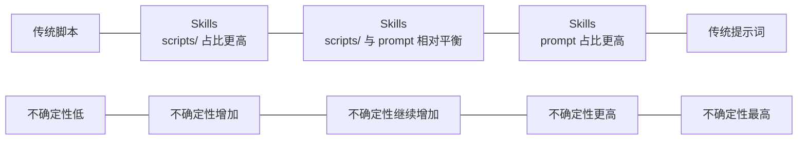

## 必须保留的两条原始判断

以下两点保留原文，不改一字：

1. Agent Skills 定义：Agent Skills 是 模型可以复用的**工作流提示词** 和 工作流中用到的**工具** 还有 **静态资源**这三者的集合。（其中subagent 可以被视做不确定性的工具， scripts/ 可以被视做确定性的工具）
2. Agent Sklls 与 传统 bash、py... 脚本和传统工作流纯文本提示词之间的关系：Agent Skills 是**介于**传统的 脚本这一**确定性**的“轮椅”和传统工作流提示词这一**不确定性**的“轮椅”之间的，能够**动态的平衡确定性与不确定性**的“轮椅”。

## 感性认识与理性认识的区别

这里需要先澄清一件事：上面那两条不是感性认识，而是理性认识。

- 我平时在使用 Agent Skills 时，先得到的是一些感性认识，也就是一些片面的使用印象。
- 比如：“它是不是一种提示词封装？”、“它是不是提示词 + 脚本？”、“它是不是一种工作流轮椅？”
- 这些印象并不完全错，但都还停留在局部观察，没有真正说明 Skill 的组成、边界与位置。
- 上面那两条观点之所以重要，正是因为它们已经不再是片面印象，而是对实践经验进行整理之后得到的理性认识。

## 对第二点观察的一个推广

如果把第二点再往前推一步，那么还可以得到一个更强的判断：

- Skills 并不是只能稳定地停在“脚本”和“提示词”之间的某个固定位置。
- Skills 其实可以通过调控 `scripts/` 和 `prompt` 的占比，向左退化成更接近传统脚本的“轮椅”，也可以向右退化成更接近传统提示词的“轮椅”。
- 也就是说，Skill 不是一个点，而更像是一段连续光谱；它真正重要的地方，不只是“介于中间”，而是“可以在中间动态滑动”。



你在正文里可以把这张图解释成：

- 越靠左，工作流越依赖确定性的 `scripts/`，模型的自由裁量空间越小。
- 越靠右，工作流越依赖开放性的 `prompt`，模型承担的判断与补全越多。
- Skill 的价值不只是站在中间，而是能根据任务性质在这条轴上重新分配“该固化什么”和“该开放什么”。

文章结构建议：

```markdown
## 引子：为什么我想重新定义 Agent Skills
- 先交代语境：这不是从官方定义出发，而是从反复使用后的困惑出发
- 点明本文目标：把使用过程中形成的感性认识，与最终沉淀出的两条理性认识区分开来，并在此基础上继续推进一个更强的推广判断
- 明确提醒自己：这两条原始判断必须原文保留，并围绕它们展开论证
- 给出读者预期：读完后，读者至少能回答“Skill 到底是什么”、“它和脚本、提示词是什么关系”，以及“为什么它可以左右退化”

## 从片面印象到理性认识：我的认识是怎么升级的
- 先交代我最开始的感性认识：提示词封装、提示词 + 脚本、工作流轮椅
- 说明这些说法为什么都只抓到了一部分，却还不够构成定义
- 引出本文的核心：真正重要的是从这些片面印象里提炼出更稳定的理性认识

## 两条原始判断：我想保住什么
- 直接贴出那两条原文观点，不改一字
- 说明为什么我要先保留原文：因为后文不是重新发明观点，而是把它们展开
- 先告诉读者：第一条在回答“Skill 是什么”，第二条在回答“Skill 处在什么位置”

## Agent Skills 到底是什么：从组成而不是口号来定义
- 先澄清一个常见误解：Skill 不只是一个提示词文件
- 正式展开第一条判断：可复用的工作流提示词 + 工作流中调用的工具 + 静态资源
- 分别解释三者的职责，并强调这三者缺一不可
- 顺势引出一个更细的内部结构：subagent 更像处理不确定性的工具，scripts/ 更像处理确定性的工具

## Agent Skills 处在什么位置：从脚本到提示词的坐标轴
- 先写清两端：传统脚本代表高确定性，传统提示词代表高不确定性
- 再展开第二条判断：Skill 介于两者之间，承担“动态平衡确定性与不确定性”的任务
- 在这里插入 mermaid 横向坐标轴，建立读者对“左脚本、右提示词”的直观印象

## 从“介于中间”到“可以滑动”：第二点观察的推广
- 这是本文新增的关键推进：Skill 不是静止中点，而是一段可以左右滑动的光谱
- 解释“退化”的含义：通过调控 `scripts/` 和 `prompt` 的占比，Skill 可以向左退化成传统脚本，也可以向右退化成传统提示词
- 明确不确定性如何随坐标轴从左到右递增
- 这一节最好配一个你自己的小例子：什么时候我把步骤固化成脚本，什么时候我宁可让模型自由发挥

## 这套理解会怎样影响我设计 Skill
- 不再把 Skill 看成“一个更长的 prompt”
- 而是看成“一个能组织模型能力、工具能力、静态知识的工作流封装”
- 进一步讨论：哪些步骤应该固化成脚本，哪些步骤应该交给 agent/subagent，哪些知识应该沉淀为资源文件
- 这一节要落到方法论：Skill 设计，本质上是在调配确定性与不确定性的比例

## 结语
- 回到“轮椅”这个比喻，但要落回工程语境
- 强调 Skill 的价值不是替代思考，而是重构人与模型的协作边界
- 收束全文：Skill 既是一种组成定义，也是一种位置判断，更是一种可调节的工作流方法
- 可以留下下一篇文章的钩子：如何设计一个真正好用的 Agent Skill
```

2. 避免的陷阱

❌ 不要把全文写成定义罗列，这篇文章最有价值的部分是“这些认识是怎么从实践里长出来的”
❌ 不要只停留在“轮椅”这个比喻上，必须把比喻落回确定性/不确定性、prompt/tool/resource 的分工
❌ 不要把 subagent 和 scripts 写成简单对立，它们更像是应对不同类型问题的两类工具
❌ 不要写成“我已经完全想明白了”的口气，保持“我在形成方法论”的学生视角会更有说服力

3. 建议的写作风格

✅ 从一次真实使用体验切入：比如你在哪个时刻意识到“Skill 不是 prompt 的附件”
✅ 用“定义 - 边界 - 例子”的顺序推进，让抽象判断始终落地
✅ 多写“为什么这样划分”，少写“它还能做很多事”，避免文章发散
✅ 允许保留一点未完成感，这会让文章更像一次认知升级，而不是教科书式定论

## 迭代记录
| 日期       | 版本  | 更新说明 |
| ---------- | ----- | -------- |
| 2026-03-24 | 0.0.1 | 创建文章骨架 |
| 2026-03-24 | 0.0.2 | 补入作者要求原文保留的两条核心观点 |
| 2026-03-24 | 0.0.3 | 补入第二点观察的推广与 mermaid 光谱图 |
| 2026-03-24 | 0.0.4 | 根据新的推广判断重排文章结构建议 |
| 2026-03-24 | 0.0.5 | 澄清感性认识与理性认识的区分 |
