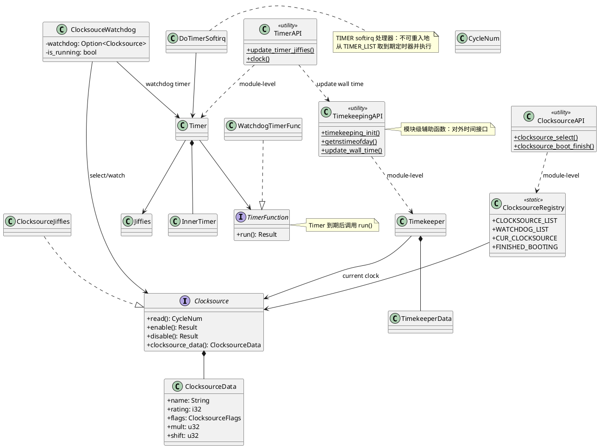
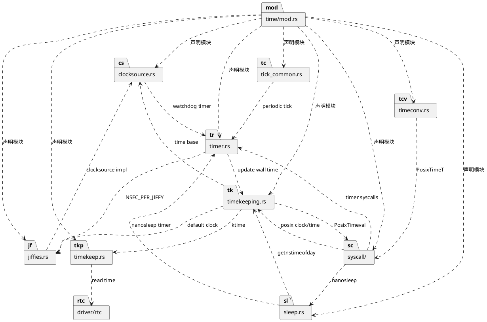
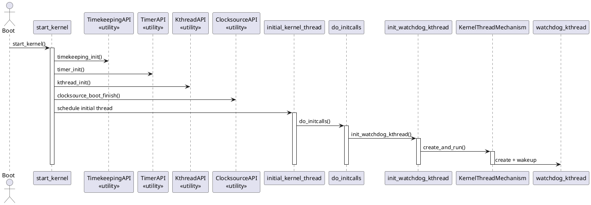
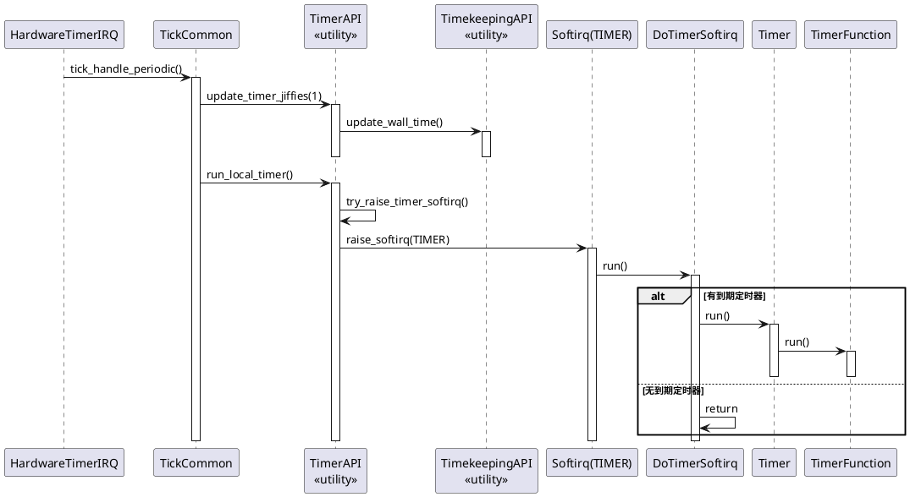
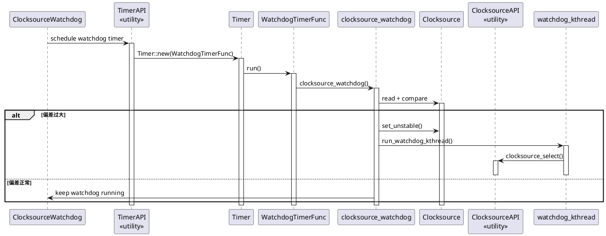
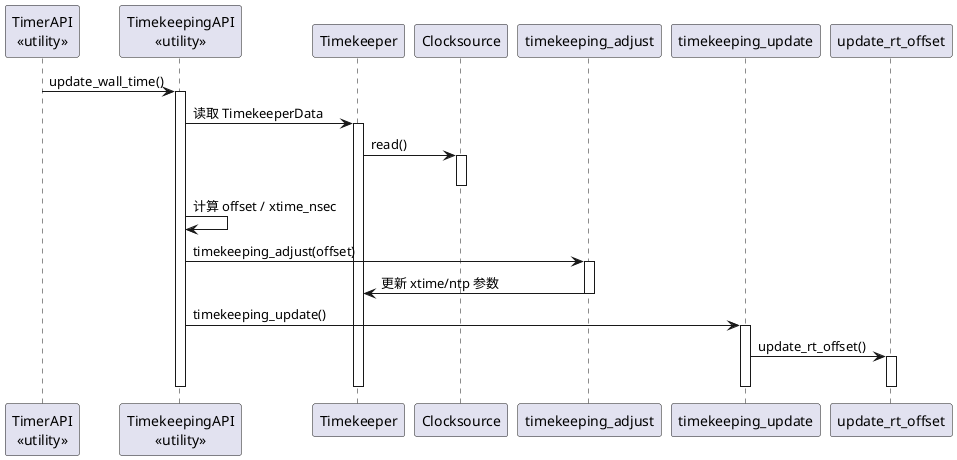

# DragonOS 时间子系统（结构化拆解）

本文档按“三步走”策略拆解时间子系统：静态视角 → 动态视角 → 分配视角。
本次先完成静态视角的类图（完整版与简化版）。

## 第一步：静态视角（Module Structure）

### 类图（完整）

### 包图（完整）

## 第二步：动态视角（C&C）

### 时序图 1：启动与 watchdog 线程初始化（模块级）

### 时序图 2：tick 驱动定时器与软中断

### 时序图 3：watchdog 检测与不稳定时钟源处理

### 时序图 4：Timekeeper 更新墙上时间（update_wall_time）

## 第三步：分配视角（Allocation）

待补充。
