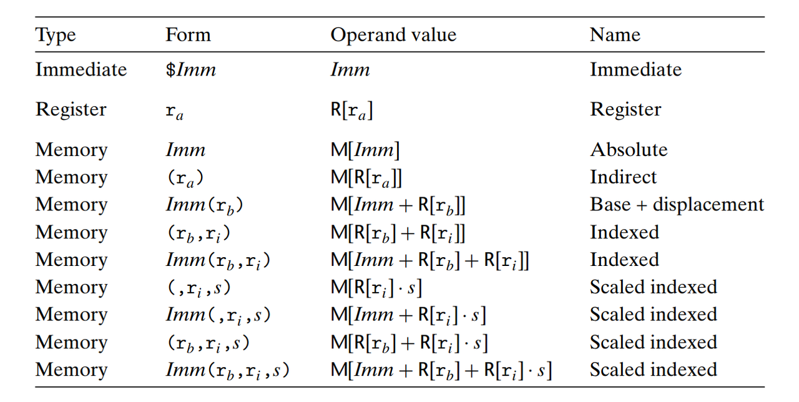
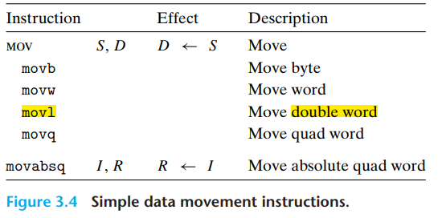
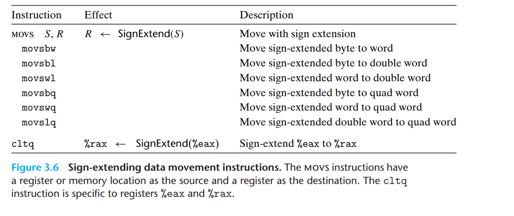
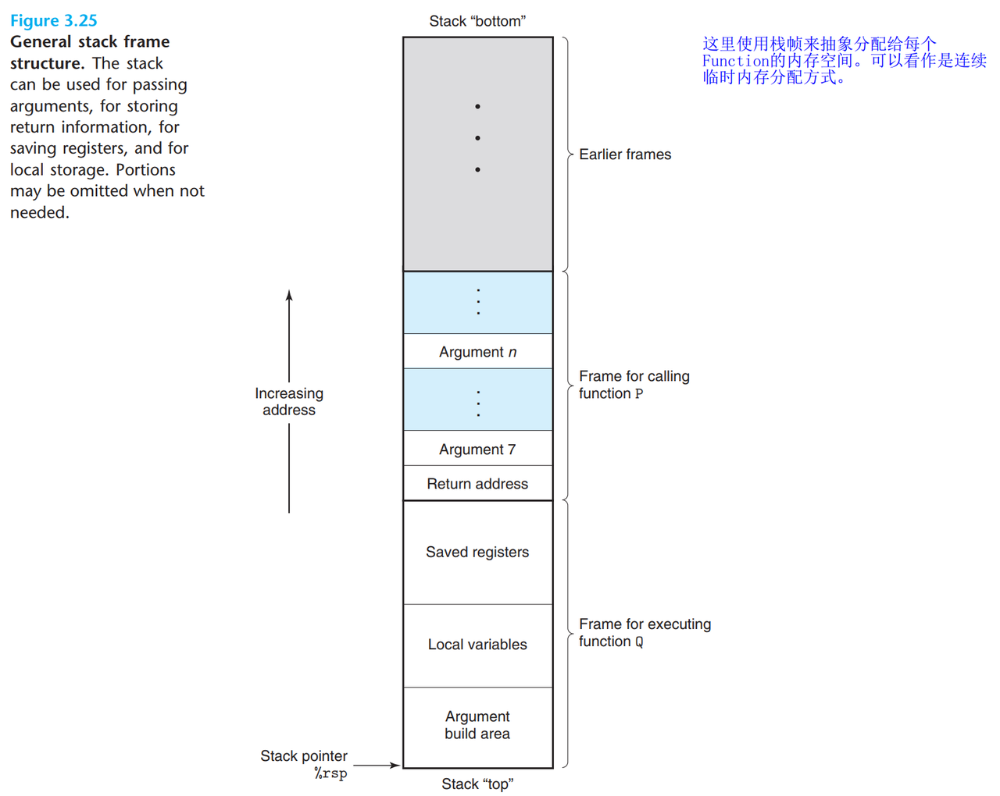
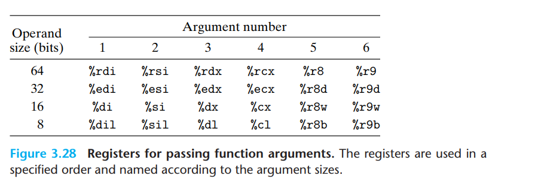
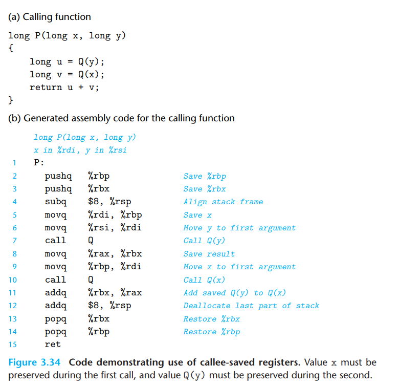

## 迭代记录

| 日期       | 版本 | 更新说明 |
| ---------- | ---- | -------- |
| 2026-02-13 | 1.0  | 初始版本，从旧文章迁移 |

---

本章节从 Intel 发展的通用计算架构开始，系统性的探讨了

## 3.1 历史沿革

* Intel 处理器的发展历程

  * 晶体管面积密度增加

  * 时钟周期越来越小 i.e.  单位时间内能够执行的指令越来越多

## 3.2 程序二进制编码（Program Encoding）

这一节给了我们一个对于程序在 `x86_64` ISA 上的二进制表示的一个宏观上的介绍

### 指令集架构 ISA 及其范畴

指令集架构包含一个处理器的 **程序员可见状态** 和 **对这些状态进行操作的规范**。

#### 程序员可见状态

* 寄存器集合（通用寄存器、PC、栈指针、状态寄存器 etc.）

* 内存模型（大小端、内存对齐规则、虚拟内存支持 etc.）

#### 状态操作规范

* 指令集（每条指令的**编码/语义**）

* 寻址模式（如何计算操作数的地址）

* 异常处理机制（Interrupt/Trap Handle)

### ISA 是真实硬件和二进制程序之间的中间层

### 程序翻译为 某一目标平台上的二进制程序的过程(C语言):

* 词法分析

* 语法分析&#x20;

* 结合某一指令集架构的指令的语义规则 通过语法制导的翻译，将高级语言程序（架构无关）翻译为 某一目标平台上的二进制程序（架构相关）

### X86\_64 汇编代码风格

* 二进制代码 与 汇编代码一一对应，除此之外，汇编代码还有程序运行不必须的 注释、链接规则 等等。

* x86\_64 指令集架构的汇编代码有 AT\&T 风格的，还有 Intel/msvc 风格的

  * ATT风格

  * Intel风格

## 3.3 数据格式    (Data Format)

* 字节（bytes）

* 字 （word）

* 双字 (double word/long word)

* 四字 (quad word)

* 由于兼容 16 位处理器的原因，1字 = 2 字节

## 3.4 访问数据    (Accessing Data)

### 操作数标识符：用于唯一指定被操作的数据的位置的一串编码（寄存器地址/内存地址）

#### 寄存器地址

#### 内存地址

| 英文名称                       | 中文名称       | 示例                        | 说明                   |
| -------------------------- | ---------- | ------------------------- | -------------------- |
| Immediate Addressing       | 立即数寻址      | movq \$42, %rax            | 操作数直接在指令中指定          |
| Register Addressing        | 寄存器寻址      | movq %rax, %rbx           | 操作数在寄存器中             |
| Direct Addressing          | 直接寻址       | movl \$1, 0x604892         | 地址是常量值               |
| Indirect Addressing        | 间接寻址       | movl \$1, (%rax)           | 地址在寄存器中              |
| Indirect with Displacement | 带位移的间接寻址   | movl \$1, -24(%rbp)        | 地址 = 基址寄存器 + 位移量     |
| Indirect with Scaled Index | 带比例变址的间接寻址 | movl \$1, 8(%rsp, %rdi, 4) | 地址 = 基址 + 变址×比例 + 位移 |
| Implicit Addressing        | 隐含寻址       | clc, ret                  | 操作数由指令隐含指定           |

### 数据移动指令

#### movx系列指令：用于 源操作数和目的操作数大小一致的情况

#### mov(扩展方式)(源操作数长度)(目的操作数长度):

#### Push && pop:

## 3.5 算数和逻辑运算指令    (Arithmetic  and Logical Operations)

* 计算内存地址（没错、这也是计算），现代CPU中存在 Address Generation Unit 能够在一个时钟周期内给出内存地址

* 一元和二元算术运算

* 逻辑运算

  * 位运算

  * 移位操作

## 3.6 控制、控制流、   (Control)

使用3.6节之前的知识，我们能够写出的程序都是只能顺序执行的，也就是每执行一条指令，PC的值递增1。

这一章节，我们将学习能够将PC的值设置为给定值的跳转指令，通过这些指令，我们能够让程序实现非顺序的执行，更好的复用已有代码。

### 什么是 Condition Code

* 条件码是存放在CPU的专用寄存器（条件寄存器）中的数据，反映了最近一次算术或逻辑运算的结果的某些属性。

* 常见的条件码主要有以下这几种：

  * `CF`: **Carry flag**。 最近一次无符号运算出现了溢出。

  * `ZF`: Zero flag。 最近一次运算的结果是0

  * `SF`: Signed flag。最近一次运算产生了负值

  * `OF`:Overflow flag。最近一次运算产生了二进制补码情况下的正/负溢出

* 使用专用指令在不修改任何通用寄存器的情况下修改 Condition Code

* 使用`set` 指令获取对最后一次操作的描述

  * 使用

* 跳转指令

* 使用条件控制实现分支结构

* 使用ConditionMove指令，简化实现简单的分支结构

* 实现循环

* 实现switch语句

## 3.7 过程调用    (Procedure)

截止至3.6章节，我们已经能够写出具有条件跳转的程序了，到这里，我们学习的指令集内容已经能够让我们的CPU模拟图灵机这一计算架构进行通用计算。换句话说，加入了显示跳转的 x86\_64 ISA 是图灵完备的。（有关于图灵完备的概念和mov指令的图灵完备性可以参见参考资料3.7）

### 运行时栈

* x86 ISA 的运行时栈的作用

  * 为每个 Procedure 提供独立的内存空间

  * 提供 Procedure Call 的数据和控制传递

* x86 ISA 的运行时栈的结构

  

### 控制转移

CPU只是忠实的执行当前PC指向的指令，使用jump Imm固然能够跳出顺序执行，但是却再也回不来了，除非在你跳转到的指令的末尾神奇的填入了jump Imm+1。问题是一个 Procedure 可能会被反复调用多次，所以说Procedure 末尾的跳回指令的目的地址不是一个 编译时常量 。所以说得有个地方用于存储这个返回地址，x86选择在栈上存储 Procedure 的返回地址。

Q1：能不能使用专用寄存器存储过程的返回地址？

A1：不能，这样只能保存一层调用的返回地址，不支持递归调用

Q2：能不能使用专门的内存空间保存函数返回地址？

A2：能，但是不实用。这样做需要额外的栈指针指向返回地址存储的位置。

* 使用 `call` `return` 指令进行返回地址的保存和恢复

### 数据传递

从一个 Procedure 移动到另一个 Procedure 后，除了寄存器里的内容不会改变，其他的都变了。那么 Procedure 如何使用上一个 Procedure 计算的数据呢。

* System V ABI 使用寄存器传递 Procedure Parameter 的约定（属于 ABI 范畴 而非 Arch 范畴）

  x86 架构支持最多6个参数传递寄存器，这里介绍的 System V ABI 会使用这全部六个寄存器。多余的参数会被逆序放入栈中，运行时则能够顺序取用。下图是寄存器传递参数的约定。

  

### 栈上的临时存储

3.7章节之前示例中的大多数过程都不需要任何超出寄存器容纳限度的本地存储。但是有时候，局部变量必须被存储在内存中。涉及到在栈上存储局部变量的情况有这些：

* 没有足够的寄存器存放临时变量

* 取地址运算要能够返回变量的地址

* 涉及到 Array 和 Struct 这种变量。

* 栈上存放临时变量的过程

  * `subq Imm %rsp` : 一次性分配好临时变量占用的空间

  * `mov local size(%rsp)` : 将局部变量存放到给定的空间

### 寄存器中的临时存储

寄存器可以看作是所有的procedure 共用的临时存储，虽然同一时间只有一个Procedure在运行，但是当所有的procedure都想在寄存器中存放临时变量以提高访问速度的时候，就涉及到如何确保一个 Procedure (*Caller)* 的临时变量不被另外一个 Procedure (*Callee*)覆盖。

* Caller Save  And  Callee Save Register

  * 被调用者保存寄存器：`%rbx, %rbp, %r12–%r15`

  * 调用者保存寄存器：除了上面以外的其他

* 一个例子说明 callee-saved Register 如何被保存

### 递归过程

## 3.8 同构数据结构："数组"的空间分配和元素访问    (Array Allocation and Accessing)

## 3.9 异构数据结构：Struct 和 Union    (**Heterogeneous Data Structures** )

## 3.10 结合控制和数据    (**Combining Control and Data in Machine-Level Programs**  )

## 参考

### 3.7