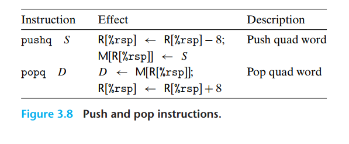

## 引言

什么是程序？从感知层次的视角有不同答案：

**用户视角**：程序是一个可以对用户的特定输入产生可预期的输出的机器

**程序员视角**：程序是由一系列函数、变量和控制结构组成的源代码文件

**编译器视角**：程序是一个抽象语法树（AST），它捕捉了源代码的结构和语义

**操作系统视角**：程序是一个可执行文件，它包含了机器指令、数据段、符号表等信息

**硬件视角**：程序是一个存储在内存中的二进制指令序列，它控制处理器的状态转换和内存访问

这些视角从上到下构成了**程序的分层视角**。本章聚焦于最底层——程序如何在硬件上被表示和执行。

什么是进程？从不同感知层次的视角也有不同答案：

对于用户来说，进程和程序没有啥区别
对于程序员来说，进程是一个正在执行的程序实例，它有自己的地址空间、资源和执行状态。
对于操作系统来说，进程包括了程序和其所能够访问的数据的集合（由操作系统虚拟内存机制抽象为虚拟地址空间中的数据），以及程序计数器、寄存器等执行状态的集合。
对于机器来说，进程就是程序在内存中的一个映像（image），它由机器指令和数据组成，并且在处理器上执行时会改变处理器的状态。

这些视角从上到下构成了**进程的分层视角**。这虽然是后面章节的内容，后面的章节也会重提，但是由于进程和线程的密不可分性，在这里提前概述十分必要，能够帮助读者建立起程序的动态观，有助于读者理解操作系统的职责。

## 3.1 历史沿革

理解了程序的分层抽象，我们从最底层的硬件视角继续向下深挖——程序最终要在具体的处理器上执行。不同的处理器有不同的指令集架构（ISA），了解这些架构的历史演进，能帮助我们理解为什么 x86_64 呈现出今天的形态，以及哪些设计决策仍在影响我们当下的编程。

本节将沿着时间线，梳理冯诺依曼体系结构计算机的发展趋势和 Intel 处理器的演进历程，最终揭示技术演进的内在逻辑。

### 3.1.1 冯诺依曼体系结构计算机发展趋势
- 晶体管面积密度增加

- 时钟周期越来越小 i.e.  单位时间内能够执行的指令越来越多

- 核心数量增加，单核性能提升放缓

### 3.1.2 Intel 处理器的发展历程

- 从 4004（1971，单晶体管）到 Alder Lake（2022，数十亿晶体管）
- 主频从 740 kHz 到 5.3 GHz（7000+ 倍提升）
- **关键转折**：2005 年功耗墙出现后，从"主频竞赛"转向"多核化"

### 3.1.3 技术演进的内在逻辑

晶体管面积密度增加：功耗墙 $\Longrightarrow$ 多核化

CPU-内存速度鸿沟扩大：内存墙 $\Longrightarrow$ 层次化缓存与程序局部性


单核提速范式迁移：提频受限 $\Longrightarrow$ 挖掘核内并行（ILP/DLP）提升 IPC
- 指令流水线（Pipelining）
- 超标量执行（Superscalar Execution）
- 分支预测（Branch Prediction）
- 向量化指令集（SIMD）: SSE, AVX, AVX-512

## 3.2 程序二进制编码（Program Encoding）

这一节给了我们一个对于程序在 `x86_64` ISA 上的二进制表示的一个宏观上的介绍。包括程序的程序的机器级别表示包括什么，不包括什么，以及某个程序的 C 语言表示和其等价的 x86\_64 机器级表示之间的关系。

### 3.2.1 指令集架构 ISA 及其范畴

指令集架构包含一个**冯诺依曼体系结构计算机**的 **程序员可见状态** 和 **对这些状态进行操作的规范**。

**程序员可见状态：**

- 寄存器集合（通用寄存器、PC、栈指针、状态寄存器 etc.）

- 内存模型（大小端、内存对齐规则、虚拟内存支持 etc.）

**状态操作规范：**

- 指令集（每条指令的**编码/语义**）

- 寻址模式（如何计算操作数的地址）

- 异常处理机制（Interrupt/Trap Handle）

**总结：** ISA 为程序员直接操纵冯诺依曼结构实现的图灵机提供了统一的规范。冯诺依曼结构通过存储程序的方式实现了通用图灵机，而 ISA 定义了程序员如何通过指令序列控制这个图灵机进行计算。

### 3.2.2 程序翻译为 某一目标平台上的二进制程序的过程(C语言):

- 词法分析

- 语法分析&#x20;

- 结合某一指令集架构的指令的语义规则 通过语法制导的翻译，将高级语言程序（架构无关）翻译为 某一目标平台上的二进制程序（架构相关）

### 3.2.3 X86\_64 汇编代码风格

- 二进制代码 与 汇编代码一一对应，除此之外，汇编代码还有程序运行不必须的 注释、链接规则 等等。

- x86\_64 指令集架构的汇编代码有 AT\&T 风格的，还有 Intel/msvc 风格的

  - At\&T风格

  - Intel风格

## 3.3 数据格式    (Data Format)

上一节介绍了 AT&T 和 Intel 两种汇编风格。在 AT&T 风格中，move指令根后缀可以分为 4 种 `movb`/`movw`/`movl`/`movq` 指令末尾的 `b`/`w`/`l`/`q` 告诉 CPU 被操作数的格式是什么。x86_64 继承自 16 位处理器，定义了字节、字、双字、四字等不同大小的数据单位。

- 字节（bytes）

- 字 （word）

- 双字 (double word/long word)

- 四字 (quad word)

- 由于兼容 16 位处理器的原因，1字 = 2 字节

## 3.4 访问数据 (Accessing Data)
<!-- TODO: 添加衔接段落。1.解释数据索引的概念，以及为什么使用虚拟内存地址 + 寄存器标识符来标识数据。2.自然的引出两地址的 mov 指令和一地址的 push/pop 指令。 -->

### 3.4.1 Addressing Data (数据寻址)


**立即数：** 
立即数是直接在指令中指定的常量值，表示为以 `$` 开头的数字。例如，在指令 `movq $42, %rax` 中，`$42` 就是一个立即数。立即数可以是整数、地址或者符号常量等。

**寄存器地址：**
对于 x86\_64 架构来说，寄存器地址就是寄存器的名字，如 `%rax`, `%rbx`, `%rcx` 等等，每个寄存器都有一个特定的功能，如 `%rax` 通常用于存储函数返回值，`%rbp` 用于存储栈帧基址，`%rsp` 用于存储栈顶地址等等。 

**内存地址：**
内存地址指向内存中的一个位置。程序通过内存地址来访问内存中的数据。内存地址可以通过寄存器中的信息结合编译时常量（立即数）来计算得到。例如，指令 `movl $1, -24(%rbp)` 中的 `-24(%rbp)` 就是一个内存地址，它表示以 `%rbp` 寄存器的值为基址，向下偏移 24 字节的位置。

内存地址遵循 `Imm(rb, ri, s)` 的通用形式，有效地址 = `Imm + R[rb] + R[ri] * s`：

- `Imm`：`movl $1, 0x604892` → `M[Imm]`，直接寻址
- `(rb)`：`movl $1, (%rax)` → `M[R[rb]]`，间接寻址
- `Imm(rb)`：`movl $1, -24(%rbp)` → `M[Imm + R[rb]]`，基址+偏移
- `(rb, ri)`：`movl (%rax, %rbx), %ecx` → `M[R[rb] + R[ri]]`，基址+变址
- `Imm(rb, ri, s)`：`movl $1, 8(%rsp, %rdi, 4)` → `M[Imm + R[rb] + R[ri]*s]`，完整形式
<div align="center">
    
    <p align="center" style="color: #666; font-size: 14px">图3-1：操作数类型和它们在汇编代码中的表示</p>
</div>


### 3.4.2 数据移动指令
我们知道如何 **Addressing** 需要操作的数据，接下来我们就要知道如何 **Accessing** & **Manipulating** 这些数据了。数据移动指令是最基本的指令类型之一，它们负责 **Accessing** 数据并将其移动到寄存器或内存中，以便后续的计算和处理。

**movx系列指令：用于 源操作数和目的操作数大小一致的情况**

<div align="center">
    
    <p align="center" style="color: #666; font-size: 14px">图3-2：movx 系列指令要求源操作数和目的操作数大小一致</p>
</div>

**mov(扩展方式)(源操作数长度)(目的操作数长度):**

<div align="center">
    
    <p align="center" style="color: #666; font-size: 14px">图3-3：movs（符号扩展）和 movz（零扩展）指令的数据扩展方式</p>
</div>

**Push && pop:**
`push S`：将源操作数 S 压入栈顶，等价于 
```asm
mov S, (%rsp)
```
`pop D`：将栈顶元素弹出到目的操作数 D，等价于 
```asm
mov (%rsp), D
add $8, %rsp
```

<div align="center">
    
    <p align="center" style="color: #666; font-size: 14px">图3-4：push/pop 指令的使用示例</p>
</div>

## 3.5 算数和逻辑运算指令    (Arithmetic  and Logical Operations)

### 3.5.1 地址运算指令

| 指令  | 说明 | 示例 |
| ----- | ---- | ---- |
| `lea S, D` | 加载有效地址（Load Effective Address） | `lea (%rax,%rsi,4), %rdx` 计算 `x + 4*i` 并存储到 `%rdx` |

Insight：`lea` 不实际访问内存，只计算地址。常用于指针算术、数组索引、多维数组地址计算。

### 3.5.2 一元算术运算

| 指令 | 效果 | 描述 |
| ---- | ---- | ---- |
| `INC D` | `D ← D + 1` | 加 1 |
| `DEC D` | `D ← D - 1` | 减 1 |
| `NEG D` | `D ← -D` | 取负（二进制补码取反加 1） |
| `NOT D` | `D ← ~D` | 按位取反 |

### 3.5.3 二元算术运算

| 指令 | 效果 | 描述 |
| ---- | ---- | ---- |
| `ADD S, D` | `D ← D + S` | 加法 |
| `SUB S, D` | `D ← D - S` | 减法 |
| `IMUL S, D` | `D ← D * S` | 有符号乘法（两个操作数形式） |
| `IMUL S, D` | `D ← S * D`（低 64 位） | 有符号乘法（三个操作数形式，如 `IMUL $10, %rax, %rdx`） |
| `XOR S, D` | `D ← D ^ S` | 异或 |
| `AND S, D` | `D ← D & S` | 按位与 |
| `OR S, D` | `D ← D \| S` | 按位或 |

Insight：`XOR %reg, %reg` 常用于将寄存器清零（比 `MOV $0, %reg` 更快、编码更短）。

### 3.5.4 移位操作

| 指令 | 效果 | 描述 |
| ---- | ---- | ---- |
| `SAL k, D` | `D ← D << k` | 算术左移（等同于 `SHL`） |
| `SHL k, D` | `D ← D << k` | 逻辑左移 |
| `SAR k, D` | `D ← D >> k`（算术右移，符号位扩展） | 算术右移 |
| `SHR k, D` | `D ← D >> k`（逻辑右移，零填充） | 逻辑右移 |

注意：移位量 `k` 可以是立即数（1-31）或存储在 `%cl` 寄存器中。

## 3.6 控制流和控制转移 (Control Flow and Control Transfer)

使用3.6节之前的知识，我们能够写出的程序都是指令序列固定也就是按照顺序执行编译时固定了顺序的代码。而这样的**指令序列静态固定**的机器在计算能力上严格弱于图灵机——它只能执行固定长度的指令序列，无法实现基于数据的条件跳转和循环，因而不具备通用计算能力。

这一章节，我们将学习能够将PC的值设置为给定值的跳转指令，通过这些指令，我们能够让程序实现非顺序的执行，从而实现条件分支、循环、函数调用等通用计算能力，模拟图灵机的计算能力。

!!! Warning 顺序执行 $\neq$ 指令序列静态固定
    x86 `mov` 指令可以通过**自修改代码**（self-modifying code）——在运行时动态修改代码段中的指令内容——来实现复杂的控制流。这种机制虽然**不改变 PC 顺序递增的执行方式**，但通过让**指令序列本身动态变化**，使得仅用 `mov` 指令编写的程序也能达到图灵完备。

!!! Note 图灵完备性的充分条件与必要条件
    **充分条件**（满足其一即可）：
    - 无界存储 + 条件分支 + 可回跳（循环/递归）：如 `jmp`, `je`, `jg`, `jl` 等跳转指令
    - While 程序（自然数变量无界）：形如 `while x != 0 do ...`
    - 极简模型也可完备：如 Minsky 两寄存器机（`INC`, `DEC/JZ`）、Rule 110

    **必要条件**（三个核心能力）：
    - **可形成无限多配置**：需要无界存储（理论上无限纸带，工程上可扩展内存）
    - **数据相关控制**：执行路径必须由运行时数据决定（比较、条件跳转）
    - **无预设上界的迭代**：允许潜在无限步（循环、递归、回跳）

    **边界反例**（不完备的模型）：
    - 直线代码：程序步数编译时固定，无法无界迭代
    - DFA/NFA：只有有限状态，无法记住无界信息
    - 原始递归函数：只有"有界递归"，缺少无界最小化（μ-operator）

    **与 x86-64 的关联**：
    - 3.6 前为何不完备：指令轨迹固定，属于直线程序
    - 3.6 引入跳转后的"质变"：`cmp/test + jcc + jmp` 让控制流依赖数据，配合内存读写即可模拟通用计算
### 3.6.1 控制流 (Control Flow)
**控制流**（Control Flow）指程序指令执行的顺序，通俗来说就是程序计数器（PC）的变化情况。在冯诺依曼体系结构中，正常情况下程序计数器（PC）按顺序递增，指令顺序执行。但实际的程序需要条件判断、循环、函数调用等非顺序执行能力。

**控制流转移的三种基本形式**：

| 形式 | 说明 | 典型指令 |
| :--- | :--- | :--- |
| **无条件跳转** | 直接跳转到指定地址 | `jmp` |
| **条件跳转** | 根据条件码状态决定是否跳转 | `je`, `jne`, `jg`, `jl` 等 |
| **过程调用/返回** | 跳转并保存返回地址 | `call`, `ret` |

理解控制流是理解程序如何从顺序执行模型扩展到通用计算能力的关键。

### 3.6.2 Condition Code 

条件码是存放在CPU的专用寄存器（条件寄存器）中的数据，反映了最近一次算术或逻辑运算的结果的某些属性。

常见的条件码主要有以下这几种：

- `CF`: **Carry flag**。 最近一次无符号运算出现了溢出。

- `ZF`: Zero flag。 最近一次运算的结果是0

- `SF`: Signed flag。最近一次运算产生了负值

- `OF`:Overflow flag。最近一次运算产生了二进制补码情况下的正/负溢出

条件码修改指令:

- `cmp S, D`：比较，计算 `D - S`，只设置条件码。示例：`cmp %rbx, %rax`

- `test S, D`：测试，计算 `D & S`，只设置条件码。示例：`test %rax, %rax`

- `add S, D`：加法，结果存 `D`，同时设置条件码。示例：`add $5, %rax`

- `sub S, D`：减法，结果存 `D`，同时设置条件码。示例：`sub %rbx, %rax`

- `inc D` / `dec D`：自增/自减，同时设置条件码。示例：`inc %rax`

条件码读取指令:

- `je label`：等于则跳转（ZF == 1）。示例：`if (a == b)`

- `jne label`：不等于则跳转（ZF == 0）。示例：`if (a != b)`

- `jg label`：有符号大于则跳转。示例：`if (a > b)`

- `jl label`：有符号小于则跳转。示例：`if (a < b)`

- `ja label`：无符号大于则跳转。示例：无符号比较

- `sete D`：等于则设置字节（ZF == 1）。示例：`bool eq = (a == b)`

- `cmove S, D`：等于则移动。示例：无分支条件赋值

!!! Question **为什么需要条件码？**
    - 时空权衡：用少量空间，换取对于需要重复获取某个条件判断计算的过程的结果的时间的优化。
    - 工程优化：条件码不是必须的！

### 3.6.3 分支结构与循环结构的汇编实现

**条件分支（if-else）**：

C 代码：`if (a > b) max = a; else max = b;`

汇编实现：比较后条件跳转，分别赋值
```asm
  cmp  %rbx, %rax      # 比较 a 和 b
  jg   .L_then         # a > b 则跳转
  mov  %rbx, %rcx      # max = b
  jmp  .L_end
.L_then:
  mov  %rax, %rcx      # max = a
.L_end:
```

**条件移动（cmov，无分支）**：

C 代码：`max = (a > b) ? a : b;`

汇编实现：条件移动指令避免分支
```asm
  cmp  %rbx, %rax      # 比较
  mov  %rbx, %rcx      # 先假设 max = b
  cmovg %rax, %rcx     # 如果 a > b，max = a
```

**循环（while）**：

C 代码：`while (i < n) { ... i++; }`

汇编实现：跳转回循环头部，条件退出
```asm
.L_loop:
  cmp  %rcx, %rax      # i < n?
  jge  .L_end          # i >= n 则结束
  ...
  inc  %rax            # i++
  jmp  .L_loop
.L_end:
```

**Switch（跳转表）**：

C 代码：`switch (x) { case 0: ... case 1: ... }`

汇编实现：跳转表实现多分支
```asm
  cmp  $1, %rax
  ja   .L_default      # x > 1 则 default
  lea  .L_jt, %rdx
  jmp  *(%rdx,%rax,8)  # 跳转表
.L_jt:
.quad .L_case0
.quad .L_case1
```
## 3.7 过程调用    (Procedure)

截止至3.6章节，我们已经能够写出具有条件跳转的程序了，到这里，我们学习的指令集内容已经能够让我们的CPU模拟图灵机这一计算架构进行通用计算。换句话说，加入了显示跳转的 x86\_64 ISA 是图灵完备的。（有关于图灵完备的概念和mov指令的图灵完备性可以参见参考资料3.7）

### 3.7.0 运行时栈

- x86 ISA 的运行时栈的作用

  - 为每个 Procedure 提供独立的内存空间

  - 提供 Procedure Call 的数据和控制传递

- x86 ISA 的运行时栈的结构

  <div align="center">
    
    <p align="center" style="color: #666; font-size: 14px">图3-4：x86-64 运行时栈的结构（栈帧包含返回地址、保存的寄存器、局部变量）</p>
</div>

### 3.7.1 控制转移

CPU只是忠实的执行当前PC指向的指令，使用 `jmp des` 固然能够跳出顺序执行，但是却再也回不来了，除非在你跳转到的指令的末尾神奇的（准确的说是在编译时）填入了 `jmp src + 1 ` 。但是一个 Procedure 可能会被反复调用多次，也可能被多个不同的位置 `src_1`, `src_2`, ..., `src_n` 调用，所以 Procedure 末尾的跳回指令的目的地址不能够是一个编译时常量 。所以说得有个地方用于存储这个返回地址，x86选择在栈上存储 Procedure 的返回地址。


Q1：能不能使用专用寄存器存储过程的返回地址？

A1：不能，这样只能保存一层调用的返回地址，不支持递归调用

Q2：能不能使用专门的内存空间保存函数返回地址？

A2：能，但是不实用。这样做需要额外的栈指针指向返回地址存储的位置。


- 使用 `call` `return` 指令进行返回地址的保存和恢复


### 3.7.2 数据传递

从一个 Procedure 移动到另一个 Procedure 后，除了寄存器里的内容不会改变，其他的都变了。那么 Procedure 如何使用上一个 Procedure 计算的数据呢。


- System V ABI 使用寄存器传递 Procedure Parameter 的约定（属于 ABI 范畴 而非 Arch 范畴）

  x86 架构支持最多6个参数传递寄存器，这里介绍的 System V ABI 会使用这全部六个寄存器。多余的参数会被逆序放入栈中，运行时则能够顺序取用。下图是寄存器传递参数的约定。

  <div align="center">
    
    <p align="center" style="color: #666; font-size: 14px">图3-5：System V ABI 参数传递寄存器约定（前 6 个整数/指针参数的寄存器分配）</p>
</div>

### 3.7.3 临时存储
临时存储是指在 Procedure 执行过程中需要暂时保存的数据，这些数据可能是局部变量、计算结果或者需要传递给下一个 Procedure 的参数。

与临时存储相对的概念是非临时存储，即 生命周期[^1] 不和 Procedure 执行周期一致的数据，如全局变量、静态变量等。这些数据一般存储在堆上或者 .data 段中。

#### 栈上的临时存储
3.7章节之前示例中的大多数过程都不需要任何超出寄存器容纳限度的本地存储。但是有时候，局部变量必须被存储在内存中。涉及到在栈上存储局部变量的情况有这些：

- 没有足够的寄存器存放临时变量

- 取地址运算要能够返回变量的地址

- 涉及到 Array 和 Struct 这种变量。


- 栈上存放临时变量的过程

  - `subq Imm %rsp` : 一次性分配好临时变量占用的空间

  - `mov local size(%rsp)` : 将局部变量存放到给定的空间


#### 寄存器中的临时存储

寄存器可以看作是所有的procedure 共用的临时存储，虽然同一时间只有一个Procedure在运行，但是当所有的procedure都想在寄存器中存放临时变量以提高访问速度的时候，就涉及到如何确保一个 Procedure (*Caller)* 的临时变量不被另外一个 Procedure (*Callee*)覆盖。


- Caller Save  And  Callee Save Register

  - 被调用者保存寄存器：`%rbx, %rbp, %r12–%r15`

  - 调用者保存寄存器：除了上面以外的其他

- 一个例子说明 callee-saved Register 如何被保存

  <div align="center">
    
    <p align="center" style="color: #666; font-size: 14px">图3-6：callee-saved 寄存器的保存与恢复（函数调用前后栈帧状态对比）</p>
</div>


### 3.7.4 递归过程

**递归过程**是指一个过程直接或间接调用自身。与普通过程相比，递归过程的关键在于每次调用都需要**独立的栈帧**来保存局部变量和返回地址。

汇编实现示例（阶乘函数）：
```asm
factorial:
  movq %rdi, -8(%rsp)     # 保存参数 n 到栈帧
  cmpq $1, %rdi           # 比较 n 和 1
  jg .L_recursive         # n > 1 则递归
  movl $1, %eax           # base case: return 1
  ret
.L_recursive:
  leaq -1(%rdi), %rdi     # n - 1
  call factorial          # 递归调用
  imulq -8(%rsp), %rax    # n * factorial(n-1)
  ret
```

关键点：
- 每次 `call factorial` 都会在栈上创建新的栈帧
- 参数 `n` 保存在栈帧中，每次递归都有独立的副本
- 递归终止条件（base case）通过 `jg` 条件跳转实现
- 返回值通过 `%rax` 传递

递归过程的实现与普通过程**完全相同**——都使用 `call`/`ret` 指令和栈帧机制。栈的 LIFO 特性保证了返回地址和局部变量的正确恢复。

## 3.8 同构数据结构："数组"的空间分配和元素访问    (Array Allocation and Accessing)

数组解决的是"大量同类型数据"的存储和访问问题。

### 3.8.1 核心概念

**同构数据**（Homogeneous Data）：所有元素类型相同。
**内存布局**：连续存储，没有"缝隙"。
**寻址公式**：`element_addr(arr, i) = x_arr + L * i`

### 简单的例子：一维定长数组

```c
int32_t arr[5];
arr[2] = 42;
```

**汇编**：
```asm
movl    $42, -8(%rbx)    # x_arr + 4 * 2 = x_arr + 8
```

关键：`4 * 2` 是**编译时常量**，直接计算，无需运行时乘法。


!!!tip 指针算术的底层实现"
    ```c
    int32_t *p = arr;
    int32_t x = *(p + 2);
    ```

    **底层实现**：
    ```asm
    movl    (%rdi, %rsi, 4), %eax    # x_p + 4 * i (带比例变址的间接寻址）
    ```

    Insight：x86_64 提供这种寻址模式，编译器无需生成乘法指令，CPU 一个时钟周期完成地址计算。

### 从一维到二维：递进式理解

```c
int32_t A[M][N];    // M 行、N 列的二维数组
```

**寻址公式**：`element_addr(A, i, j) = x_A + L * (N * i + j)`

关键点：
- 外层数组：`A` 是包含 `M` 个元素的数组
- 每个元素：包含 `N` 个 `int32` 的数组
- `N * i` 和 `4 * j` 的乘法合并为 `4 * (N * i + j)`：CPU 只需执行一次乘法

### 固定长度 vs 可变长度数组

**固定长度数组**（栈上）：
```c
void foo() {
    int32_t A[3][4];    // 编译时大小已知：3 * 4 * 4 = 48 字节
    A[1][2] = 42;       # 编译器能计算出地址
}
```

**可变长度数组**（堆上）：
```c
void foo(int32_t m, int32_t n) {
    int32_t **A = malloc(m * sizeof(int32_t*));    // 分配 m 个指针
    for (int32_t i = 0; i < m; i++) {
        A[i] = malloc(n * sizeof(int32_t));   // 每行分配 n 个 int32
    }
    A[1][2] = 42;       # 如何访问？
}
```

**寻址**：`element_addr(A, i, j) = x_A[i] + sizeof(T) * j`

关键点：
1. `A` 是一个指针数组，`A[i]` 是第 `i` 个指针
2. `x_A[i]` 是**运行时读取**的（从指针数组中获取）
3. `sizeof(T) * j` 可以在编译时计算（`T` 是 `int32`）

**为什么可变长数组需要知道第二维的长度？**

因为在编译时，编译器需要知道每"行"的大小（`sizeof(T) * N`），才能生成正确的寻址指令。如果 `N` 是运行时变量，编译器无法预知。

**历史包袱**：C 语言要求在函数参数中显式给出第二维长度，就是这个原因：
```c
void foo(int32_t A[][4], int32_t m);    # 正确：第二维长度必须给出
void foo(int32_t A[][], int32_t m);    # 错误：第一维可以省略，第二维不行
```

## 3.9 异构数据结构：Struct 和 Union (Heterogeneous Data Structures)

这一章主要介绍 C 语言中组织不同类型对象的方法：Struct 和 Union。

### 3.9.1 Struct：连续内存布局

**核心**：Struct 中的各个对象在连续的内存空间中排列。

**访问**：通过字段名访问各个对象，汇编代码与 C 代码对照讲解。

**sizeof(struct) 对齐规则**：
- 对齐准则 1：给定长度为 k 字节的类型，其地址偏移量必须是 k 的整数倍
- 对齐准则 2：Struct 的大小必须是最大字段长度的整数倍

Insight：对齐是为了 CPU 快速计算出地址，牺牲空间换时间。

### 3.9.2 Union：共享存储空间

**核心**：Union 中的各个对象共用同一片存储空间。

**好处**：节省内存，同一时刻只能存储其中一个对象。

**应用场景**：类型标签联合体、解析二进制数据。

### 3.9.3 数据对齐的两个准则
1. 给定长度为 k 字节的类型，其地址偏移量只能是 k 的整数倍
2. Struct 的大小需要是最大字段长度的整数倍


## 3.10 结合控制与数据    (**Combining Control and Data in Machine-Level Programs**)

这一章将之前学习的数据表示和控制流结合起来，探讨更复杂的程序结构。

### 函数指针

**核心**：函数指针是代码段地址的引用，用于间接调用。

**声明与使用**：
```c
int (*f)(int, int);  // f 是指向"返回 int、接受两个 int 参数的函数"的指针
f = &foo;            // 获取函数地址
int result = f(42, 13);  // 通过指针调用
```

**底层实现**：
```asm
lea    foo(%rip), %rax    # 获取函数地址
movq   %rax, f(%rbp)     # 存储到函数指针变量
call   *f(%rbp)           # 间接调用（通过指针跳转）
```

Insight：函数指针不占用数据空间，只存储代码地址。声明时的参数和返回值类型为编译器提供类型检查，而非运行时信息。

### 缓冲区溢出攻击

**成因**：
- C 语言对数组访问不进行边界检查
- 栈上的局部变量（缓冲区）可以被越界写入
- 攻击者通过精心构造的输入覆盖函数返回地址

**攻击原理**：
1. 被调用函数的栈帧包含定长缓冲区（如 `char buf[64]`）
2. 使用不安全的函数（如 `gets`、`strcpy`）导致越界写入
3. 攻击者输入恶意数据覆盖返回地址
4. 函数返回时 CPU 跳转到攻击者指定的地址

**防御措施**：
- 使用安全的字符串函数（`strncpy`、`snprintf`）
- 栈金丝雀（Stack Canary）：在返回地址前插入随机值，函数返回前检查
- NX 位：标记栈区域不可执行
- ASLR（地址空间布局随机化）

## 本章总结

### 核心概念回顾

从冯诺依曼体系结构的角度看，本章构建了从 C 代码到机器指令的完整映射：

**数据表示层**：
- 整数和浮点数的编码方式（第 2 章）如何影响指令选择
- 数据对齐规则如何牺牲空间换取访问速度
- 结构化数据（数组、结构体）的内存布局如何决定访问模式

**控制流层**：
- 条件码（CF/ZF/SF/OF）如何实现条件跳转
- 函数调用如何通过栈传递控制和数据
- 调用约定如何平衡性能（寄存器传递）和兼容性（栈传递）

**寻址模式层**：
- x86_64 的多种寻址模式如何对应高级语言的数据访问
- 指针算术如何被编译器优化为带比例变址的间接寻址

### 与实践项目的联系

**DragonOS 内核开发**：
- 理解栈帧结构帮助你调试系统调用时的寄存器保存/恢复问题
- 理解函数调用约定（System V ABI）有助于编写与 C 代码兼容的 Rust 内核代码
- 理解缓冲区溢出原理让你在实现 `pwritev` 等系统调用时更加注重安全检查

**CS149 并行计算**：
- 理解数据局部性：数组的连续内存布局如何影响缓存命中率
- 理解指令级并行（ILP）：第 3.10 节的函数指针间接调用如何影响 CPU 分支预测
- 性能优化基础：只有理解汇编层面，才能判断某种 C 代码变换是否真的提升了性能（例如，循环展开是否能减少指令数）

**CMU 15-445 数据库系统**：
- 理解内存布局是优化 Buffer Pool 的前提
- 结构体对齐规则影响 B+ Tree 节点在内存中的存储密度
- 指针算术在数据库记录定位中的应用

### 下一步：第 4 章 处理器体系结构

第 3 章教会了我们"程序如何被表示"，第 4 章《处理器体系结构》将揭示"程序如何被高效执行"：

**硬件-软件接口**：
- 现代处理器如何通过流水线、分支预测、超标量执行来加速指令执行
- 为什么某些代码模式（如数据依赖）会限制 ILP，以及如何重写代码以释放性能
- 理解 CPU 的"实际 CPI"与理想 CPI 的差距

**性能优化的理论基础**：
- CS149 中的 SIMD 指令（AVX-512）如何利用向量执行单元
- 内存墙问题：为什么单纯提升 CPU 频率不再带来线性性能提升
- 能效考量：第 3.1 节提到的功耗墙将在第 4 章得到量化解释

**学习建议**：
在开始第 4 章前，建议做到：
- 能熟练阅读基本的 x86_64 汇编代码（算术运算、内存访问、条件跳转）
- 能理解函数调用的完整过程（参数传递、栈帧分配、返回地址恢复）
- 能分析简单 C 程序的汇编表示，并指出可能的性能瓶颈

---
## 参考

### 3.7


---
## 迭代记录

| 日期       | 版本   | 更新说明                                                                                         |
| ---------- | ------ | ------------------------------------------------------------------------------------------------ |
| 2026-02-13 | v0.1.0 | 初始版本，从旧文章迁移                                                                           |
| 2026-02-14 | v0.1.1 | 补充 3.8 3.9 3.10 内容                                                                           |
| 2026-02-21 | v0.1.2 | 新增引言和总结、充实 3.1 历史沿革（技术演进的内在逻辑）、补充 3.8/3.9/3.10、格式统一（列表标记） |
| 2026-02-22 | v0.1.3 | 结构优化（章节编号规范化）、修正 ISA 定义、为所有图片添加说明、为 3.5 节添加算术逻辑指令表格     |
| 2026-02-24 | v0.1.4 | 优化引言结构（五个视角清晰呈现）、为 3.1 添加导引段落                                            |
| 2026-02-24 | v0.1.5 | 修订引言部分，增加对进程的定义及其分层视角的描述                                                 |
| 2026-02-25 | v0.1.6 | 添加数据格式和数据寻址部分，更新控制流和递归过程的描述                                           |